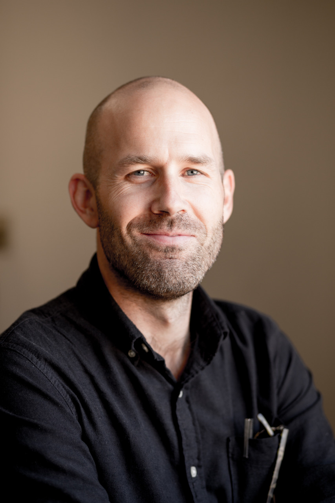

```{r setup, include=FALSE}
knitr::opts_chunk$set(echo = TRUE)
```
`[cooperborken at wisc.edu]`  

My name is Matt and I am a language researcher. Currently, I am a graduate student in Psychology at the University of Wisconsin - Madison, where I study language and learning, mostly in the context of reading development. I work in the [Language and Cognitive Neuroscience Laboratory](http://lcnl.wisc.edu) with Mark Seidenberg.
  
I am interested in how kids develop reading ability, the sources of knowledge that underlie that development, and what we can do to support it through intelligent changes in the environment. This includes more formal educational experiences, like instruction, but also less formal ones, like through choosing books to read with kids. My interests in learning relate back to my experiences as an elementary school teacher for kids with reading challenges, which was my profession prior to starting work in psychology.
  
In addition to doing research on learning, language, and reading, I also try to communicate about the relevance of my science in educational contexts. See [here](https://psyarxiv.com/sq4fr/) and [here](./data/seidenberg_etal_2020_rlj.pdf) for more of that. I've had the great opportunity to be a Fellow in the [Interdisciplinary Training Program in Education Sciences](https://itp.wceruw.org) at UW-Madison, a training program at Wisconsin dedicated to the education sciences, which in my time there focused on issues of research and practice in education.

<br>

###   [**research**](./research.html) | [**cv**](./data/cv-mcb.pdf) | [**github**](https://github.com/MCooperBorkenhagen) | [**twitter**](https://twitter.com/CoopBork)


