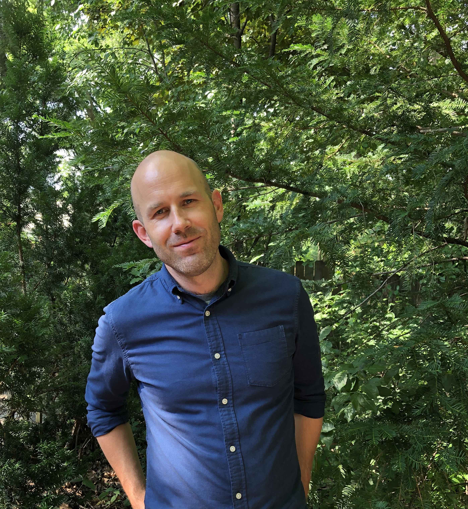

```{r setup, include=FALSE}
knitr::opts_chunk$set(echo = TRUE)
```

Welcome to my website. I am a graduate student in Psychology at the University of Wisconsin - Madison, and I study language, learning, mostly in the context of reading development. I am interested in how kids develop reading ability, the sources of knowledge that underlie that development, and what we can do to support that development through intelligent changes in the environment. This includes formal educational means, like through instruction, but also less formal means, like through choosing books to read to kids, or the language that we use to interact with them.

